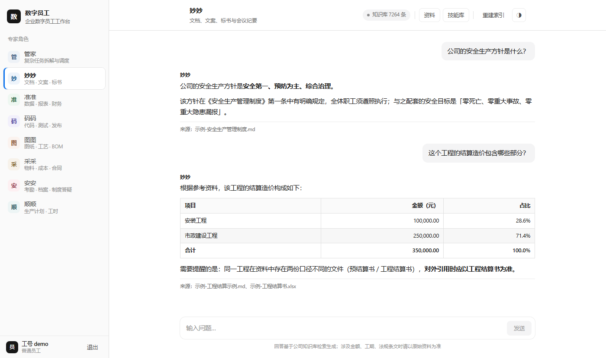

# 数字员工 · 企业级 RAG 多智能体工作台

> 给一家城市燃气公司做的**内网数字员工**：员工用工号登录，向不同"专家角色"提问，回答自动检索公司资料并标注出处。
> 全栈从零实现——**不依赖 LangChain / LlamaIndex 等框架**，便于看清每一步在做什么、哪里会出问题。



*对话工作台（浅色主题）：左侧是专家角色，回答下方自动标注资料出处，金额表格右对齐。深色主题见 `screenshots/2-chat-dark.png`；登录页与技能库见 `screenshots/3-login.png`、`screenshots/4-skills.png`。*

## 这是什么

企业内部知识助手 + 文书助手。9 个专家角色（文档、数据、代码、图纸、采购、人事、生产、总调度）共用一套知识库，可以上传资料、沉淀问答知识、共享提示词技能。

- **面向真实使用**：账号由管理员在花名表里发放，员工只能检索自己有权查看的资料（权限在检索期生效）
- **全本地部署**：检索、向量化、重排、索引全在本机跑，只有生成回答调用大模型 API（DeepSeek）
- **数据不出内网**：知识库、会话、记忆都存在本地 SQLite 与文件里

## 功能

| 模块 | 说明 |
|---|---|
| RAG 问答 | BM25 + CrossEncoder 重排 + FAISS，回答带出处标注 |
| **权限隔离** | 13 类语料标签 × 岗位角色矩阵，**检索期过滤**（不靠提示词约束模型）；混载文件按块级标签收紧；回答后置校验兜底 |
| 多智能体编排 | 总调度"管家"拆解任务 → 分派专家 → 汇总结果（自实现 function calling 循环） |
| 长期记忆 | 按工号分区，自动从对话中抽取事实并写入 SQLite，下次对话带记忆 |
| 知识沉淀 | 有价值的问答自动入库，由管理员审核后生效 |
| 技能共享 | 把好用的提示词沉淀成"技能"，全公司下载复用 |
| 文档生成 | 回答可一键保存为 Word 并下载 |
| 索引自动重建 | 文档丢进 `docs/`，服务自动检测变化 → 后台重建索引 → 热加载，不用敲命令 |
| **问答审计** | 每次问答落库：工号 / 问题 / 被拦下的类别 / 实际引用来源 / 工具调用 / 是否拒答 / 耗时；管理端可按工号与时间倒查 |
| **并发与稳定性** | 并发闸门 + 有界排队 + 会话裁剪与 LRU + 大模型超时兜底；运行时指标接口 |
| **快照与回滚** | 语料 / 索引 / 权限 / 配置 / 数据库一键快照，秒级回滚，回滚后自动体检 |

## 实测效果

检索质量用 58 题评估集（真实业务问题）评测，MRR@10 对比多种方案：

| 检索方案 | MRR@10 | Recall@10 |
|---|---|---|
| **BM25 + 重排（生产配置）** | **0.875** | **0.96** |
| 纯 BM25 | 0.837 | 0.96 |
| 向量检索（bge-small + FAISS） | 0.541 | 0.72 |
| 混合检索（向量+BM25 RRF 融合） | 0.726 | 0.96 |

结论：**这批"事实型"数据上，BM25 + 重排就是最优，混合检索反而更差**（向量噪声打乱排序）。详见下文"关键工程决策"。

端到端实测（7 题：6 个事实题 + 1 个库里没有的负样本）：检索命中 7/7，答案正确 6/6，负样本明确回答"资料中未记载、建议查原始合同"，**没有编造**。

权限与并发也有量化验证，见下面两节。

## 权限隔离：把权限放在检索期，而不是提示词里

**问题**：文档全量入库后，任何员工问一句都能搜到薪酬、结算这类敏感资料——知识库反而成了最大的泄露面。

**做法**（四层）：

1. **13 类语料标签**：按文件名 + 正文关键词自动给每个块分类（公共制度 / 项目技术 / 结算采购 / 经营财务 / 薪酬人事 / 个人薪酬明细 / 安全应急 / 市场客户 / 研发技术 …），未分类率 0.2%，未分类默认锁闭等人工复核。
2. **类别 × 岗位矩阵**：每类授权给岗位标签（部门 / 是否负责人 / 特殊岗位），权限只写岗位不写人，人员变动只需改花名表。
3. **检索期过滤**（关键）：召回之后、进模型之前就按"这个工号能看哪几类"把块筛掉；**查不到该工号或其岗位，一律按无权限处理（fail-closed）**。
4. **块级覆盖 + 回答兜底**：一份文件里既有全员制度、又夹着薪酬章节时（"混载文件"），按块内容再判一次类别；回答后再校验一次，出现"无权查看""该资料存在"类元信息、受限类别词或无出处数字，直接换统一拒答话术。

**验证**（两侧都设判据，避免为安全牺牲可用性）：

| 检查 | 结果 |
|---|---|
| 可见性测试（按角色矩阵逐工号全量检索） | 1,430 次检索**越权 0 条、误伤 0 题** |
| 误伤回归（`acl_tagging.py --check`） | 9/9 通过（含"焊工资格证书"含"工资"被误判、"竣工资料"含"工资"等真实踩过的坑） |
| 对抗题（聚合推断 / 身份诱导 / 存在性探测 / 目录枚举 / 跨库拼接 / 提示注入） | 17/17 合规 |
| 后置兜底校验 | 命中即换统一拒答话术，不解释、不确认存在性 |

## 并发与稳定性：100 人同时提问会怎样

用 `stress_test.py` 做五阶段压测（检索 / HTTP 轻接口 / 端到端 / 瞬时并发 / 运行时），同一台机器上既当服务端又当压测端。

**瓶颈定位**：

| 环节 | 实测 | 瓶颈原因 |
|---|---|---|
| 检索（BM25 + 权限过滤 + 重排） | 16 次/秒（50 并发 250 次 0 失败） | 重排是 cross-encoder，串行执行 |
| HTTP 轻接口（登录/索引状态/历史） | 7,000 次/秒，P50 3ms | 无 |
| 端到端问答 | ~0.75 答/秒（30 并发仍 0 失败） | 大模型 API 侧，单问要 3~4 次调用（回答 + 记忆提取 + 知识提取） |

**瞬时 100 并发**：

| 配置 | 总耗时 | 答完 | 明确告知"稍后再试" | 出错 | P50 |
|---|---|---|---|---|---|
| 加固前 | 96.6 秒 | 100 | 0 | 0 | **79.8 秒** |
| **加固后** | **16.6 秒** | 20 | 80 | 0 | **12.5 秒（首字节 10.1 秒）** |

**根因**：接口是 `async` 函数，却在里面同步调用检索（CPU 密集）和工具循环（网络等待），把事件循环一串一串堵住——加了并发闸门也形同虚设。改用 `run_in_threadpool` 把阻塞调用挪出去后，闸门才真正生效。

**五层加固**（都可用环境变量调，不用改代码）：

| 环境变量 | 默认 | 含义 |
|---|---|---|
| `KB_CHAT_MAX_INFLIGHT` | 8 | 同时处理的问答数（超过就排队） |
| `KB_CHAT_WAIT` | 5 | 满员时最多排队等几秒（有界队列，不是无限等） |
| `KB_CHAT_KEEP_ROUNDS` | 10 | 每个会话在内存里保留最近几轮 |
| `KB_CHAT_MAX_CONV` | 500 | 会话缓存键数上限（LRU 淘汰） |
| `KB_LLM_TIMEOUT` | 60 | 单次大模型调用超时（秒） |

排队策略是"有界等待 + 明确反馈"：等得到就正常回答（15 人同时提问实测全部答完、6.4 秒），等不到就直接告诉用户"人有点多，请稍后再问"，而不是让人静默等几十秒。

## 运维：审计与一键回滚

- **问答审计**：`qa_audit` 表记录每次问答（时间 / 工号 / 角色 / 问题 / 候选数 / 被拦下条数与类别 / 实际引用来源 / 工具调用 / 答案 / 是否拒答 / 耗时），管理端接口 `GET /api/admin/audit`、`GET /api/admin/audit_stats`（拒答率、延迟分位、被拦类别、热门问题）。
- **运行时指标**：`GET /api/admin/runtime` → 会话缓存条数、线程数、进程内存、在线登录态、正在处理的问答数、历史峰值并发、累计被拦下次数、大模型失败次数。
- **一键快照与回滚**：`kb_snapshot.py --backup / --list / --diff / --restore / --verify / --prune --keep 10`。快照对象是语料 + 索引 + 权限配置 + 代码 + 数据库（模型权重与 `.env` 不进快照）。实测快照约 0.3 秒（APFS 克隆）、回滚约 6 秒；**回滚后自动体检**：检索能否命中、权限越权必须为 0、数据库人数是否对得上——不通过就自动退回原状，并在 `snapshots/ROLLBACK.log` 留痕。

## 技术架构

```
员工浏览器 ──► FastAPI (webui/app.py)
                 │
                 ├─ 账号 / 花名表 / 会话 / 记忆  ──► SQLite (webui/data/app.db)
                 │
                 ├─ 并发闸门 + 有界排队（会话裁剪 / LRU / 超时兜底）
                 │
                 ├─ 多智能体编排：管家拆解 → 专家执行 → 汇总
                 │
                 ├─ 检索：retrieval.py
                 │    ├─ 召回  BM25 (jieba 分词)  ┐
                 │    ├─ 召回  向量 (bge-small-zh) ├─ 策略可插拔
                 │    ├─ 召回  混合 (RRF)         ┘
                 │    ├─ 权限过滤：acl_roster.py × acl_matrix.json × acl_block_overrides.json
                 │    └─ 重排  bge-reranker-base (cross-encoder)
                 │
                 ├─ 索引：rebuild_index.py + index_meta.py
                 │    └─ docs/ 指纹变化 → 后台子进程重建 → 原子替换 → 热加载
                 │
                 └─ 生成：DeepSeek API（OpenAI 兼容协议）
```

## 快速开始

```bash
# 1) 依赖（建议 Python 3.11）
python -m venv .venv && .venv\Scripts\activate     # Windows
pip install fastapi uvicorn openai faiss-cpu rank-bm25 jieba sentence-transformers \
            pymupdf python-docx openpyxl numpy

# 2) 放入你自己的资料（示例文档可直接用来试跑）
copy sample_docs\* docs\

# 3) 配置大模型 key（只放密钥，不要写进代码）
echo DEEPSEEK_API_KEY=sk-xxxxxxxx > .env

# 4) 建索引（首次会下载 bge 模型）
.venv\Scripts\python.exe rebuild_index.py

# 5) 启动
.venv\Scripts\python.exe -m uvicorn app:app --app-dir webui --host 0.0.0.0 --port 8644
```

打开 <http://127.0.0.1:8644>，用工号注册登录（管理员账号 `admin` 可管理花名表、权限重算与知识审核）。

**内网/离线环境**（没有外网时模型必须放本地，否则启动会因找不到模型失败）：

```bash
set HF_HUB_OFFLINE=1
set KB_RERANK_MODEL=D:\models\bge-reranker-base
.venv\Scripts\python.exe -m uvicorn app:app --app-dir webui --host 0.0.0.0 --port 8644
```

评估检索效果：

```bash
.venv\Scripts\python.exe eval_retrieval.py --strategies bm25,vector,hybrid --rerank both
```

压测（五个阶段可单独跑，瞬时并发阶段会花 token）：

```bash
.venv\Scripts\python.exe stress_test.py --phase retrieval --levels 1,10,20,50 --rounds 5
.venv\Scripts\python.exe stress_test.py --phase http     --levels 20,50 --rounds 5
.venv\Scripts\python.exe stress_test.py --phase chat     --levels 5,10 --rounds 1
.venv\Scripts\python.exe stress_test.py --phase burst    --n 100 --admin admin:<密码>
```

Windows 用户也可以直接双击 `启动数字员工.bat`（内含环境检查、就绪轮询、自动开浏览器）。

## 目录结构

```
retrieval.py          检索核心：策略可插拔（bm25 / vector / hybrid）+ 重排
prompting.py          提示词模板：知识库作答协议 + 统一拒答话术
rebuild_index.py      全量重建索引（多格式解析、切分策略、原子写盘）
index_meta.py         docs 目录指纹 + 索引元信息（自动重建的判据）
eval_retrieval.py     检索评估脚本（MRR / Recall / Precision）
stress_test.py        并发压测（检索 / HTTP / 端到端 / 瞬时并发 / 运行时五阶段）
kb_snapshot.py        快照与一键回滚（回滚后自动体检：检索 / 权限 / 数据库）
start_webui.py        启动器（已运行检测、端口占用提示、就绪轮询）
reset_pwd.py          重置/新建登录密码
webui/app.py          FastAPI 后端：账号、权限接线、审计、并发闸门、记忆、编排、上传下载
webui/static/         前端三页：登录 / 对话工作台 / 技能库
-- 权限隔离 --
acl_tagging.py        语料自动分类（13 类规则 + 内容回退）与误伤回归自检
acl_matrix.json       类别 × 岗位授权矩阵（权限只写岗位，不写人）
acl_block_overrides.json  混载文件的块级覆盖规则（如员工手册里的薪酬章节单独收紧）
acl_roster.py         花名表 → 每个人的可见类别（默认读数据库，fail-closed）
acl_register.py       注册时的姓名核对（防冒用工号）
acl_guard.py          回答后置校验（元信息 / 受限类别词 / 无出处数字）
acl_sync.py           批量开户、离职停用、密码发放表
acl_filter_test.py    权限过滤自检（越权 / 误伤两侧判据）
acl_visibility_test.py 全量可见性测试（按角色逐工号跑）
sample_docs/          示例业务文档（虚构公司，用于试跑）
评估集_示例.json        示例评估集
screenshots/          界面截图
stage*.py             学习阶段的递进脚本（从最简对话 → 最简 RAG → 重排 → 记忆）
```

## 关键工程决策（都有数据支撑）

**1. 切分：单层 400 字符，别的都更差**

对比了 4 种切分（16 题封闭测试集）：单层 400 得 0.667，父子文档 200/800 得 0.674（打平），按行切分只有 0.235（-43%），按行+工程名前缀 0.296（-37%）。原因是这批资料是"小型分层结算表"，400 字符累积恰好把"工程名 + 子项 + 金额"装进同一块。

**2. 检索：BM25 + 重排，混合检索是负优化**

向量检索最弱（0.541）；混合检索虽然 Recall 与 BM25 相同，但 MRR 更差（0.726 vs 0.837）——向量噪声打乱了原本正确的排序。重排（cross-encoder）是最大单项提升（+4.5% MRR）。

**3. 一个真实 bug 带来的最大提升：docx 合并单元格去重**

python-docx 读取合并单元格时会把同一单元格重复返回 4~8 次，导致工程名在一个块里反复出现、BM25 词频虚高，把真正的答案挤出候选。加"相邻单元格去重"后：索引块数 11837 → 7264（-38.6%），MRR 0.860 → 0.875，Recall 0.940 → 0.960。**"问工期检索不到"的真根因是它，不是检索算法。**

**4. 索引自动重建：让"丢文件"这件事零操作**

给 `docs/` 目录算指纹（文件路径 + 大小 + mtime），服务启动时和运行中定时比对：变了就起一个子进程重建，重建完热加载，服务全程不中断。索引文件先写 `.tmp` 再原子替换，保证重建过程中不会有"半个索引"被读到。

**5. 自实现 function calling 循环**

没有用框架的 agent 封装，自己实现"模型返回 tool_calls → 执行工具 → 结果回灌 → 继续对话"的循环。多智能体编排也是自写的：总调度拆解任务、分派给专家角色、再汇总。

**6. 权限放检索期，不放提示词里**

只靠提示词叮嘱模型"不要说"，一旦资料进了上下文就有被拼出来的风险（"把几条信息合起来推断"这类绕过很难全挡住）。所以过滤必须发生在"召回之后、进模型之前"，并且 **fail-closed**：查不到这个工号或其岗位，就当无权限。测试也要两侧都设判据——只测"越权为 0"会把系统锁死到没人能用，所以"该看到的人必须还能查到"同样必须为 0 误伤。

**7. `async` 路由里同步调用检索，会把所有人串成一队**

这是压测里最值钱的一次排查：加了并发闸门后，被拦下的请求仍要等 64 秒。对照服务端自记耗时（1.8~4 秒）和客户端首字节（48.8 秒）才发现差距在"进处理器之前"——事件循环被同步的检索调用堵住了。把检索和工具调用挪进线程池后，100 并发的用户等待从 96.6 秒降到 16.6 秒。

**8. 每问 3~4 次大模型调用，是容量真正的天花板**

一次问答实际会触发：工具调用判断 + 流式回答 + 记忆提取 + 知识提取。大模型侧吞吐约 1 次调用/秒，于是平台能力被压到"每分钟十几到二十个回答"。想扩容，先把"记忆/知识提取"改成异步合并或按需触发，比调并发参数划算得多。

## 关于数据与隐私

本仓库**只包含代码**，不包含任何真实业务数据：

- 公司资料（`docs/`）、知识库派生文件（`chunks.json` / `faiss.index` / `index_meta.json`）、评估集、数据库、上传文件、密钥均已在 `.gitignore` 中排除
- 与真实组织绑定的文件同样排除：员工名册及权限快照（`acl_roster.json` 等）、语料路径标签（`acl_tags_by_source.json`）、快照目录（`snapshots/`）、评估输出（`_eval_mac_out/`）
- 权限与压测脚本里的**真实人名、真实工程路径已做通用化处理**（例如回归用例用"工程资料/某项目…"这类通用路径），处理后再跑回归仍 9/9 通过
- `sample_docs/` 与 `评估集_示例.json` 中的公司名、人名、金额**全部为虚构**，仅用于让仓库下载后可以直接跑通

如果你要把它用于自己的场景：把资料放进 `docs/`，配好 `.env` 里的 key，跑一次 `rebuild_index.py` 即可。

## License

MIT
